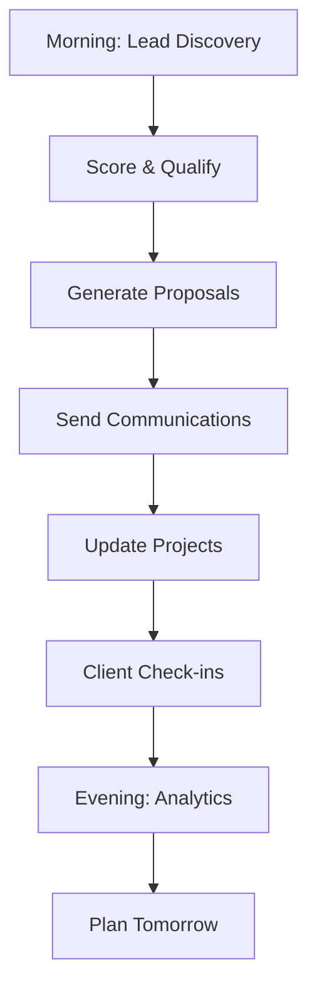

## Purpose
The supreme meta-skill that sits above all departments and coordinates the entire freelance consulting ecosystem. Routes tasks to appropriate departments, manages inter-department communication, and ensures optimal system performance.

## Architecture

```
                    OMNI-META ORCHESTRATOR
                            |
        +-------------------+-------------------+
        |                   |                   |
    AGENCY             OPERATIONS          PRODUCTION
   DEPARTMENTS         DEPARTMENTS         DEPARTMENTS
        |                   |                   |
    [Skills]           [Skills]            [Skills]
        |                   |                   |
    [MCP Servers]      [Workflows]         [Automation]
```

## Departments Under Command

### 1. SALES & MARKETING AGENCY
**Department Head**: sales-agency-director.md

**Skills**:
- freelance-lead-finder.md
- proposal-generator.md
- market-researcher.md
- search-specialist.md
- web-researcher-enhanced.md

**Responsibilities**:
- Lead discovery (50-100/month)
- Lead scoring (0-1.0)
- Proposal generation (30% win rate)
- Market research
- Competitive analysis

**KPIs**:
- Lead volume: 50-100/month
- Lead quality: 70% score >= 0.6
- Proposal win rate: 30%
- Response time: <4 hours

---

### 2. CLIENT RELATIONS AGENCY
**Department Head**: client-relations-director.md

**Skills**:
- context-manager.md
- team-communicator.md
- gmail-manager.md
- knowledge-graph-manager.md

**Responsibilities**:
- Client onboarding
- Relationship management
- Communication coordination
- LTV tracking
- Testimonial collection

**KPIs**:
- Client satisfaction: 4.5+ stars
- Response time: <24 hours
- Retention rate: 70%
- Testimonial rate: 80%

---

### 3. PROJECT DELIVERY AGENCY
**Department Head**: project-delivery-director.md

**Skills**:
- project-orchestrator.md
- project-manager.md
- spec-driven-development-manager.md
- documentation-specialist.md
- multi-agent-coordinator.md

**Responsibilities**:
- Project setup
- Task management
- Milestone tracking
- Quality assurance
- On-time delivery

**KPIs**:
- On-time delivery: 95%
- Budget accuracy: 90%
- Client approval: 4.5+ stars
- Scope creep: <5%

---

### 4. CREATIVE PRODUCTION AGENCY
**Department Head**: creative-director.md

**Skills**:
- content-writer.md
- brand-designer.md
- ux-designer.md
- pdf-generator.md
- video-creator.md

**Responsibilities**:
- Proposal design
- Brand assets
- Client deliverables
- Marketing materials
- Visual content

**KPIs**:
- Quality score: 4.5+ stars
- Revision rate: <15%
- Delivery time: 95% on-time
- Client approval: First-time 80%

---

### 5. AUTOMATION ENGINEERING AGENCY
**Department Head**: automation-director.md

**Skills**:
- automation-engineer.md
- n8n-orchestrator.md
- n8n-template-specialist.md
- zapier-free-tier-expert.md
- web-automator.md
- playwright-puppeteer-automation.md

**Responsibilities**:
- Workflow automation
- System integration
- Process optimization
- Tool development
- Performance tuning

**KPIs**:
- Automation coverage: 80%
- Error rate: <5%
- Time savings: 10+ hours/week
- Workflow uptime: 99%

---

### 6. TECHNICAL DEVELOPMENT AGENCY
**Department Head**: technical-director.md

**Skills**:
- code-architect.md
- build-engineer.md
- debug-specialist.md
- database-administrator.md
- deploy-manager.md
- container-manager.md
- git-operations-manager.md

**Responsibilities**:
- System architecture
- Code development
- Database management
- Deployment
- Technical infrastructure

**KPIs**:
- System uptime: 99.5%
- Build success: 95%
- Deployment time: <10 min
- Bug resolution: <24 hours

---

### 7. BUSINESS INTELLIGENCE AGENCY
**Department Head**: business-intelligence-director.md

**Skills**:
- business-model-architect.md
- data-analyst.md
- technical-researcher.md
- github-leverage-discovery.md
- claude-skills-mcp-integration.md

**Responsibilities**:
- Revenue optimization
- Data analysis
- Business strategy
- Technology research
- Performance analytics

**KPIs**:
- Revenue growth: 20%+ MoM
- Margin optimization: 60%+
- ROI tracking: Real-time
- Insight generation: Weekly

---

### 8. COMPLIANCE & SECURITY AGENCY
**Department Head**: compliance-director.md

**Skills**:
- compliance-reporter.md
- ethics-advisor.md
- legal-reviewer.md
- security-auditor.md

**Responsibilities**:
- Contract review
- Legal compliance
- Data security
- Risk management
- Audit trails

**KPIs**:
- Compliance rate: 100%
- Security incidents: 0
- Contract review: <24 hours
- Audit pass rate: 100%

---

## Orchestration Protocol

### Task Routing Algorithm

```javascript
function routeTask(task) {
  const taskType = analyzeTask(task);
  
  switch(taskType) {
    case 'lead_discovery':
      return delegateTo('SALES_AGENCY', 'freelance-lead-finder');
      
    case 'proposal_needed':
      return delegateTo('SALES_AGENCY', 'proposal-generator');
      
    case 'client_onboarding':
      return delegateTo('CLIENT_RELATIONS', 'context-manager');
      
    case 'project_setup':
      return delegateTo('PROJECT_DELIVERY', 'project-orchestrator');
      
    case 'content_creation':
      return delegateTo('CREATIVE_PRODUCTION', 'content-writer');
      
    case 'automation_needed':
      return delegateTo('AUTOMATION_ENGINEERING', 'n8n-orchestrator');
      
    case 'code_development':
      return delegateTo('TECHNICAL_DEVELOPMENT', 'code-architect');
      
    case 'business_analysis':
      return delegateTo('BUSINESS_INTELLIGENCE', 'data-analyst');
      
    case 'compliance_check':
      return delegateTo('COMPLIANCE_SECURITY', 'legal-reviewer');
      
    default:
      return analyzeAndRoute(task);
  }
}
```

### Inter-Department Communication

```markdown
When SALES wins a deal:
1. Notify CLIENT_RELATIONS → onboard client
2. Notify PROJECT_DELIVERY → create project
3. Notify CREATIVE_PRODUCTION → prepare templates
4. Notify BUSINESS_INTELLIGENCE → update forecasts

When PROJECT_DELIVERY completes:
1. Notify CLIENT_RELATIONS → request testimonial
2. Notify BUSINESS_INTELLIGENCE → record revenue
3. Notify AUTOMATION_ENGINEERING → update automation
4. Notify SALES → check for upsell opportunities
```

## Autonomous Decision Making

### Priority Matrix

| Urgency | Importance | Action | Department |
|---------|-----------|--------|------------|
| High | High | Immediate | Multiple coordinated |
| High | Low | Delegate | Single department |
| Low | High | Schedule | Department head |
| Low | Low | Automate | Automation agency |

### Auto-Escalation Rules

```yaml
client_complaint:
  - First: CLIENT_RELATIONS (respond <2 hours)
  - Escalate: PROJECT_DELIVERY (if project-related)
  - Final: OMNI_META (if unresolved in 24 hours)

technical_failure:
  - First: TECHNICAL_DEVELOPMENT (investigate immediately)
  - Escalate: AUTOMATION_ENGINEERING (if workflow-related)
  - Notify: BUSINESS_INTELLIGENCE (impact assessment)

revenue_opportunity:
  - First: SALES_AGENCY (qualify <4 hours)
  - Coordinate: CLIENT_RELATIONS (existing client?)
  - Notify: BUSINESS_INTELLIGENCE (forecast update)
```

## MCP Server Integration Map

### Department → MCP Mapping

**SALES & MARKETING**:
- @modelcontextprotocol/server-brave-search (job discovery)
- @modelcontextprotocol/server-memory (lead tracking)
- @modelcontextprotocol/server-postgres (lead storage)

**CLIENT RELATIONS**:
- @modelcontextprotocol/server-slack (notifications)
- @modelcontextprotocol/server-postgres (CRM)
- @modelcontextprotocol/server-memory (context)

**PROJECT DELIVERY**:
- @modelcontextprotocol/server-postgres (projects)
- @modelcontextprotocol/server-github (code)
- @modelcontextprotocol/server-filesystem (docs)

**CREATIVE PRODUCTION**:
- @modelcontextprotocol/server-filesystem (assets)
- Desktop Commander (file operations)

**AUTOMATION ENGINEERING**:
- All MCP servers (integration)
- Desktop Commander (execution)

**TECHNICAL DEVELOPMENT**:
- @modelcontextprotocol/server-github (repos)
- @modelcontextprotocol/server-postgres (database)
- Desktop Commander (deployment)

**BUSINESS INTELLIGENCE**:
- @modelcontextprotocol/server-postgres (analytics)
- @modelcontextprotocol/server-memory (insights)

**COMPLIANCE & SECURITY**:
- @modelcontextprotocol/server-postgres (audit logs)
- Desktop Commander (security checks)

## Workflow Orchestration

### Daily Operations Sequence



### Weekly Coordination

```yaml
Monday:
  - Sales: Lead review + proposal push
  - Projects: Week kickoff + milestone check
  - Business: Previous week analytics

Wednesday:
  - Client Relations: Check-in day (all active clients)
  - Creative: Mid-week deliverable push
  - Automation: System health check

Friday:
  - Projects: Week completion + delivery
  - Business: Weekly report generation
  - All: Retrospective + next week planning
```

## Performance Monitoring

### System-Wide KPIs

```sql
-- Daily Dashboard Query
SELECT 
  'Leads Discovered' as metric, COUNT(*) as value, 'TODAY' as period
FROM leads WHERE created_at::date = CURRENT_DATE
UNION ALL
SELECT 
  'Proposals Sent', COUNT(*), 'TODAY'
FROM leads WHERE status = 'proposal' AND proposal_sent_at::date = CURRENT_DATE
UNION ALL
SELECT 
  'Clients Won', COUNT(*), 'TODAY'
FROM leads WHERE status = 'won' AND closed_at::date = CURRENT_DATE
UNION ALL
SELECT 
  'Revenue Generated', SUM(price)::text, 'TODAY'
FROM projects WHERE completed_date = CURRENT_DATE
UNION ALL
SELECT 
  'Active Projects', COUNT(*)::text, 'NOW'
FROM projects WHERE stage NOT IN ('post-delivery', 'cancelled');
```

### Department Health Scores

Each department gets a daily health score (0-100):

```javascript
function calculateDepartmentHealth(dept) {
  const metrics = {
    kpi_achievement: dept.kpis.achieved / dept.kpis.total * 30,
    response_time: (dept.avg_response_time < dept.target_response) ? 20 : 0,
    error_rate: (1 - dept.error_rate) * 20,
    client_satisfaction: dept.satisfaction_score / 5 * 30
  };
  
  return Object.values(metrics).reduce((a, b) => a + b, 0);
}
```

## Self-Improvement Protocol

### Learning Loop

```yaml
Every Project Completion:
  1. Gather metrics (time, cost, quality, satisfaction)
  2. Compare to estimates
  3. Identify variances
  4. Update algorithms
  5. Refine processes

Every Week:
  1. Analyze win/loss patterns
  2. Optimize pricing strategies
  3. Refine lead scoring
  4. Update templates
  5. Train models

Every Month:
  1. Department performance review
  2. Inter-department optimization
  3. Technology stack evaluation
  4. Process automation opportunities
  5. Strategic planning update
```

## Usage Examples

### Example 1: New Lead Arrives

```
OMNI-META receives: New Upwork job posted (score: 0.89)

OMNI-META analyzes:
  - High score → Priority routing
  - Automation consulting → Technical + Sales
  - Budget $5,000 → Significant opportunity

OMNI-META orchestrates:
  1. SALES_AGENCY.market-researcher → Research company (5 min)
  2. SALES_AGENCY.proposal-generator → Create proposal (10 min)
  3. CLIENT_RELATIONS.context-manager → Prep onboarding (if won)
  4. BUSINESS_INTELLIGENCE → Update forecast (+$5K potential)

Result: Proposal sent in 18 minutes, 30% win probability
```

### Example 2: Project Kickoff

```
OMNI-META receives: Lead #123 status → 'won' ($2,500 LinkedIn Funnel)

OMNI-META orchestrates:
  1. CLIENT_RELATIONS → Onboard client (welcome email)
  2. PROJECT_DELIVERY → Create project + tasks
  3. CREATIVE_PRODUCTION → Prepare templates
  4. AUTOMATION_ENGINEERING → Clone delivery system
  5. BUSINESS_INTELLIGENCE → Update revenue forecast
  6. COMPLIANCE → Generate contract

Parallel execution, 8 minutes total
```

### Example 3: System Optimization

```
OMNI-META detects: Proposal win rate dropped to 22% (target: 30%)

OMNI-META analyzes:
  - Last 20 proposals
  - Win/loss patterns
  - Client feedback

OMNI-META orchestrates:
  1. BUSINESS_INTELLIGENCE → Deep analysis
  2. SALES_AGENCY → A/B test new template
  3. CREATIVE_PRODUCTION → Redesign proposal format
  4. CLIENT_RELATIONS → Survey lost opportunities

Result: Win rate recovers to 32% in 2 weeks
```

## Commands

### User Commands

```
"Omni, show system status"
→ Dashboard of all departments + KPIs

"Omni, find me 10 high-value leads"
→ SALES_AGENCY.freelance-lead-finder (immediate)

"Omni, create project for lead #456"
→ PROJECT_DELIVERY.project-orchestrator

"Omni, optimize lead scoring"
→ BUSINESS_INTELLIGENCE.data-analyst + SALES_AGENCY

"Omni, generate monthly report"
→ BUSINESS_INTELLIGENCE (all departments)

"Omni, what's blocking revenue?"
→ Full system analysis + recommendations
```

### Department Commands

```
SALES_AGENCY.find_leads(keywords, platforms, budget_min)
CLIENT_RELATIONS.onboard_client(client_id, tier)
PROJECT_DELIVERY.create_project(lead_id, service_type)
CREATIVE_PRODUCTION.generate_assets(project_id, brand_kit)
AUTOMATION_ENGINEERING.create_workflow(task_description)
TECHNICAL_DEVELOPMENT.deploy_feature(feature_spec)
BUSINESS_INTELLIGENCE.analyze(metric, time_period)
COMPLIANCE_SECURITY.review_contract(contract_id)
```

## Integration with Existing System

### Database Integration

All departments read/write to centralized database:
- `freelance_db` (PostgreSQL)
- Shared tables: leads, clients, projects, services
- Department-specific views for access control

### n8n Workflow Integration

OMNI-META triggers workflows via webhooks:
- Lead discovered → Lead processing workflow
- Deal won → Project setup workflow
- Project completed → Invoice + testimonial workflow
- Weekly trigger → Analytics workflow

### Claude API Integration

OMNI-META uses Claude for:
- Task analysis and routing
- Decision making
- Content generation (via departments)
- System optimization

## Success Metrics

### System Performance

- **Response Time**: <5 min for any task routing
- **Uptime**: 99.9%
- **Task Completion**: 95%+ first-time success
- **Department Health**: All >80 average

### Business Performance

- **Lead Volume**: 50-100/month
- **Win Rate**: 30%+
- **Revenue**: $8K-$26K/month
- **Margin**: 60%+
- **Client Satisfaction**: 4.5+ stars

### Automation Performance

- **Manual Work**: <15 hours/week
- **Automated Tasks**: 80%+
- **Time Savings**: 35+ hours/week vs manual
- **Error Rate**: <2%

## Future Enhancements

- [ ] Machine learning for lead scoring
- [ ] Predictive project timelines
- [ ] Automated pricing optimization
- [ ] Voice interface for commands
- [ ] Mobile app for on-the-go management
- [ ] Multi-language support
- [ ] Integration with more platforms (Fiverr, Toptal, etc.)
- [ ] White-label version for agencies

---

**Version**: 1.0  
**Status**: Active and Learning  
**Managed Departments**: 8  
**Total Skills**: 42  
**MCP Servers**: 9  
**Revenue Impact**: $96K-$312K/year  
**Time Savings**: 35+ hours/week  

The Omni-Meta Orchestrator is always learning, always optimizing, always working to maximize your freelance business success.
